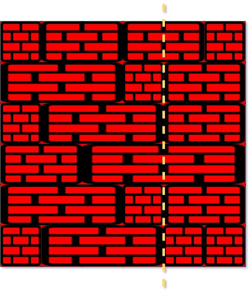

[链接](https://leetcode-cn.com/problems/brick-wall/solution/java-fan-xiang-si-wei-li-yong-hashbiao-b-2ivd/)

```
你的面前有一堵矩形的、由 n 行砖块组成的砖墙。这些砖块高度相同（也就是一个单位高）但是宽度不同。每一行砖块的宽度之和应该相等。

你现在要画一条 自顶向下 的、穿过 最少 砖块的垂线。如果你画的线只是从砖块的边缘经过，就不算穿过这块砖。你不能沿着墙的两个垂直边缘之一画线，这样显然是没有穿过一块砖的。

给你一个二维数组 wall ，该数组包含这堵墙的相关信息。其中，wall[i] 是一个代表从左至右每块砖的宽度的数组。你需要找出怎样画才能使这条线 穿过的砖块数量最少 ，并且返回 穿过的砖块数量 。


```



### 解题思路
将 砖块算成一个整体， 通过累加的形式 算出在 i的时候是否有砖块
通过计算相同砖块的边界，取最大值，这样利用 层数减去 就能得到最终答案

### 代码

```java
class Solution {
    public int leastBricks(List<List<Integer>> wall) {
        HashMap<Integer, Integer> map = new HashMap();
        for (List<Integer> w: wall) {
            int cnt = 0;
            for (int i = 0; i < w.size() - 1; i++) {
                cnt += w.get(i);
                map.put(cnt, map.getOrDefault(cnt, 0) + 1);
            }
        }
        int maxCnt = 0;
        for (Map.Entry<Integer, Integer> entry: map.entrySet()) {
            maxCnt = Math.max(entry.getValue(), maxCnt);
        }
        return wall.size() - maxCnt;

    }
}
```
