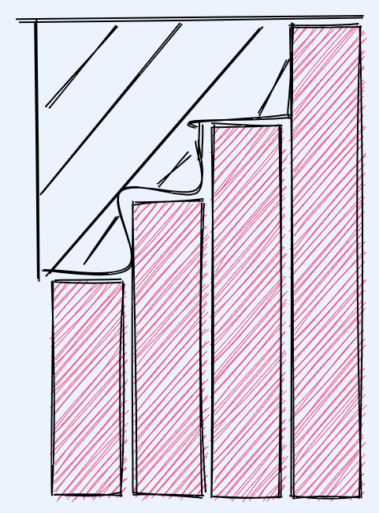

## 题目地址(1838. 最高频元素的频数)

https://leetcode-cn.com/problems/frequency-of-the-most-frequent-element/

## 题目描述

```
元素的 频数 是该元素在一个数组中出现的次数。

给你一个整数数组 nums 和一个整数 k 。在一步操作中，你可以选择 nums 的一个下标，并将该下标对应元素的值增加 1 。

执行最多 k 次操作后，返回数组中最高频元素的 最大可能频数 。

 

示例 1：

输入：nums = [1,2,4], k = 5
输出：3
解释：对第一个元素执行 3 次递增操作，对第二个元素执 2 次递增操作，此时 nums = [4,4,4] 。
4 是数组中最高频元素，频数是 3 。

示例 2：

输入：nums = [1,4,8,13], k = 5
输出：2
解释：存在多种最优解决方案：
- 对第一个元素执行 3 次递增操作，此时 nums = [4,4,8,13] 。4 是数组中最高频元素，频数是 2 。
- 对第二个元素执行 4 次递增操作，此时 nums = [1,8,8,13] 。8 是数组中最高频元素，频数是 2 。
- 对第三个元素执行 5 次递增操作，此时 nums = [1,4,13,13] 。13 是数组中最高频元素，频数是 2 。


示例 3：

输入：nums = [3,9,6], k = 2
输出：1


 

提示：

1 <= nums.length <= 105
1 <= nums[i] <= 105
1 <= k <= 105
```

## 前置知识

-

## 公司

- 暂无

## 思路

## 关键点

- 思路看图



## 代码

- 语言支持：Java

Java Code:


```java

class Solution {
    public int maxFrequency(int[] nums, int k) {
        Arrays.sort(nums);
        long total = 0;
        int l = 0;
        int r = 1;
        int res = 1;
        for (; r < nums.length; ++r) {
            total += (long)(nums[r] - nums[r-1]) * (r-l);
           // 这里是排序后进行
            while (total > k) {
                total -= nums[r] - nums[l];
                l++;
            }
            res = Math.max(res, r-l+1);
        }
        return res;

    }
}

```


**复杂度分析**

令 n 为数组长度。

- 时间复杂度：$O(nlogn)$  时间复杂度主要浪费在了
- 空间复杂度：$O(1)$
